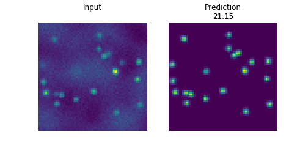
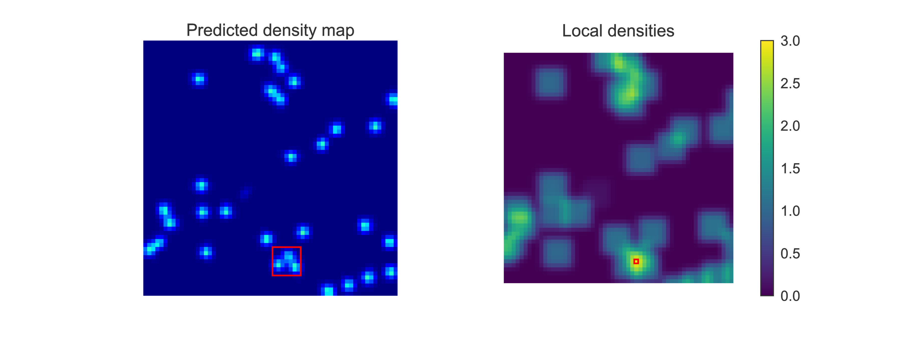

Instructions
============

.. contents::
   :depth: 3

Installation
------------

You will need a trained DEFCoN network model to use the plugin
regardless of the installation procedure that you choose to
follow. These may be downloaded from the `DEFCoN-ImageJ Wiki
<https://github.com/LEB-EPFL/DEFCoN-ImageJ/wiki>`_.

Fiji/ImageJ update site
+++++++++++++++++++++++

1. Make a backup of your Fiji folder. (This is always a good idea
   before adding an `update site
   <https://imagej.net/List_of_update_sites>`_.
2. Open Fiji and navigate to *Help > Update...*. Install any updates
   and restart Fiji if necessary.
3. In the ImageJ Update dialog, click the *Manage update sites*
   button, scroll to the bottom of the list, and add
   http://sites.imagej.net/Kmdouglass under the URL column. You may
   give it any name you want, such as LEB-EPFL.
4. Install all the updates and restart Fiji.
5. Verify that the plugin is recognized by clicking **Plugins** on the
   menu bar and looking for **DEFCoN**.

Manual installation
+++++++++++++++++++

1. Download the latest DEFCoN-ImageJ .jar and dependencies from the
   `GitHub releases
   <https://github.com/LEB-EPFL/DEFCoN-ImageJ/releases>`_.
2. Place the DEFCoN-ImageJ .jar file inside your
   **<ImageJ_Root>/plugins** folder. Unzip the dependencies into the
   **<ImageJ_Root>/jars** folder.
3. Verify that the plugin is recognized by opening ImageJ/Fiji by
   clicking **Plugins** on the menu bar and looking for **DEFCoN**.

Using DEFCoN
------------

DEFCoN provides two kinds of networks for spot counting. They are
called

1. **density map**
2. **maximum local count**

The density map network produces a density map estimate from an
image. The sum of the pixel values in a region of the density map is
equal to the estimated number of fluorescent spots within that region.

         map representation.

The maximum local count network first computes the sum of the pixels
in all possible subregions of the density map. It returns the single
largest value of all these sums. In effect, it reports the highest
*local* density of spots across an entire image. (The original maximum
count network available on the DEFCoN-ImageJ wiki uses 7x7 pixels
subregions.)

	 from a predicted density map.

The ImageJ GUI
++++++++++++++

1. Open an image or image stack or select a currently open
   image/stack.
2. Navigate to **Plugins > DEFCoN > Density map...** on the menu bar.
3. A dialog will appear asking for you to enter the name of a
   folder. This folder should contain a saved TensorFlow model of a
   DEFCoN density map network. (The dialog will remember the previous
   path that was used, meaning you will not have to reenter this path
   every time you wish to use DEFCoN.)
4. Click OK to start processing.

To compute the maximum local count, repeat these steps but select
**Plugins > DEFCoN > Maximum local count...** instead. In the dialog,
select a folder containing a saved maximum local count network.

ImageJ macros
+++++++++++++

The macro panel may be accessed through the menu bar by navigating to
**Plugins > New > Macro**.

The macros for running the counting network and maximum local count
network are::

  run("Density map...","load=/path/to/density/network");
  run("Maximum local count...", "load=/path/to/max/count/network");

Training your own DEFCoN networks
---------------------------------

Information on training your own DEFCoN network may be found at the
`DEFCoN project page <https://github.com/LEB-EPFL/DEFCoN>`_. DEFCoN
will usually perform best when trained on data that closesly matches
your particular use case.
